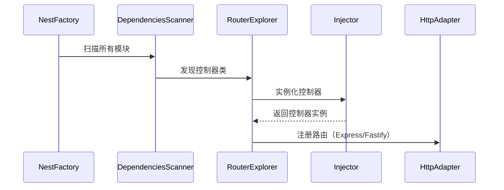

## Controller 的声明与作用
```js
@Controller("users")
export class UserController {
  @Get() findAll() {
    return [];
  }
}
```
* `@Controller('users')` 将类标记为路由控制器，定义基础路径 `/users`。
* `@Get()` 将方法映射到 `GET /users` 路由。


### 1. Nest 如何发现并注册这些装饰的控制器？

> 源码文件位置：@nestjs/common/decorators/core/controller.decorator.ts
装饰器的核心作用是通过 reflect-metadata 为控制器类添加元数据，这些元数据会被 NestJS 框架在启动时读取和使用：
```ts
export function Controller(prefixOrOptions?: string | string[] | ControllerOptions): ClassDecorator {
  const defaultPath = '/';

  const [path, host, scopeOptions, versionOptions] = isUndefined(
    prefixOrOptions,
  )
    ? [defaultPath, undefined, undefined, undefined]
    : isString(prefixOrOptions) || Array.isArray(prefixOrOptions)
      ? [prefixOrOptions, undefined, undefined, undefined]
      : [
        prefixOrOptions.path || defaultPath,
        prefixOrOptions.host,
        { scope: prefixOrOptions.scope, durable: prefixOrOptions.durable },
        Array.isArray(prefixOrOptions.version)
          ? Array.from(new Set(prefixOrOptions.version))
          : prefixOrOptions.version,
      ];

  return (target: object) => {
    Reflect.defineMetadata(CONTROLLER_WATERMARK, true, target); // 标记为控制器
    Reflect.defineMetadata(PATH_METADATA, path, target); // 路由前缀
    Reflect.defineMetadata(HOST_METADATA, host, target); // 域名
    Reflect.defineMetadata(SCOPE_OPTIONS_METADATA, scopeOptions, target); // 作用域
    Reflect.defineMetadata(VERSION_METADATA, versionOptions, target); // 版本
  };
}
```
eg.
```ts
@Controller({
  path: 'admin', // 路由前缀
  host: 'admin.example.com',// 域名
  version: ['1', '2'], // 版本
  scope: Scope.REQUEST, // 作用域
})
export class AdminController {
  @Get('dashboard')
  getDashboard() {
  } // 路由: GET v1/admin/dashboard 或 v2/admin/dashboard
}
```
> host 的作用（基于域名的路由控制）,admin.example.com → 访问后台 、api.example.com → 访问 API、 example.com → 访问主站
> * 访问 https://admin.example.com → 返回后台页面
> * 访问 https://api.example.com → 返回 API 数据
> * 访问 https://example.com → 这两个控制器均不响应
>
> 需要配置服务器（如 Nginx）或 DNS 将子域名指向同一服务。
```ts
@Controller({ host: 'admin.example.com' })
export class AdminController {
  @Get()
  getAdminPage() {
    return '这是后台管理页面';
  }
}

@Controller({ host: 'api.example.com' })
export class ApiController {
  @Get()
  getData() {
    return { data: 'API 数据' };
  }
}
```
> Scope 的本质：控制依赖实例的生命周期
> 在 NestJS 中，几乎所有的类（如 Controller、Service、Provider）都是由 依赖注入（DI）容器 管理的。scope 决定了这些类的实例：
>* 何时创建（比如每次请求都新建，还是全局只建一个）
>* 何时销毁（比如请求结束后是否自动清理）
>* 如何共享（不同地方注入的是否是同一个实例）
>
> NestJS 提供了 3 种作用域（Scope）：
>
>1. `DEFAULT`（默认）：单例模式，整个应用共享一个实例。适用场景：
>* 无状态服务（如工具类、配置服务）
>* 数据库连接池（全局共享）
>* 缓存服务（如 Redis 客户端）
>2. `REQUEST`：每个 HTTP 请求都会创建一个新实例，请求结束后销毁。适用场景：
>* 需要访问请求上下文（如 Request 对象）
>* 需要隔离请求之间的数据（如用户鉴权、事务管理）
>* 避免并发问题（如请求间共享可变状态）
>3. `TRANSIENT`：每次注入时都创建一个新实例（极少使用）。适用场景：
>* 需要完全隔离实例（如临时计算服务）
>* 极少使用，除非有特殊需求。


### >2. 装饰器如何将元数据转化为实际的路由逻辑？
Nest 启动时通过以下步骤处理控制器：

#### 阶段 1：模块扫描 </br>
在 NestFactory.create() 初始化阶段，InstanceLoader 和 DependenciesScanner 会扫描模块的 controllers 数组（如 AppModule 中声明的控制器）。

``const app = await NestFactory.create(AppModule);`` </br>
``NestFactory.create() -> InstanceLoader.createInstances()``
```ts
@Module({
  imports: [UsersModule],
  controllers: [AppController],
  providers: [AppService],
})
export class AppModule {}
```
1.扫描模块树
> 源码文件位置：packages/core/scanner.ts
```ts
class DependenciesScanner{
  public async scan(
    module: Type<any>,
    options?: { overrides?: ModuleOverride[] },
  ) {
    await this.registerCoreModule(options?.overrides); // 注册核心模块，如 InternalCoreModule），提供基础服务（如 Reflector、ModuleRef）。这些模块是框架运行的基础，优先初始化
    await this.scanForModules({
      moduleDefinition: module,
      overrides: options?.overrides,
    }); // 递归扫描子模块，扫描模块树，如AppModule中的imports
    await this.scanModulesForDependencies();  // 解析模块依赖
    this.addScopedEnhancersMetadata(); // 处理作用域增强器

    // Modules distance calculation should be done after all modules are scanned
    // but before global modules are registered (linked to all modules).
    // Global modules have their distance set to MAX anyway.
    this.calculateModulesDistance(); // 计算模块距离，计算模块在依赖树中的“距离”（从根模块到该模块的层级深度）。

    this.container.bindGlobalScope(); // 绑定全局作用域，将全局模块（@Global() 装饰的模块）绑定到所有模块，使其可被任意模块注入。
  }
  
}

```

2.收集控制器 </br>
读取 @Module() 中声明的 controllers，并存储到 NestContainer：
> 源码文件位置：packages/core/scanner.ts

#### 阶段 2：控制器实例化 </br>
1.依赖解析 </br>
通过 Injector.resolveConstructorParams() 解析控制器的依赖（如 UserService）：
> 源码文件位置：packages/core/injector/injector.ts

2.实例化控制器 </br>
使用 new 操作符创建实例，并缓存到 NestContainer：
> 源码文件位置：packages/core/injector/instance-loader.ts
```ts
class InstanceLoader {
  public async createInstancesOfDependencies(
    modules: Map<string, Module> = this.container.getModules(),
  ) {
    this.createPrototypes(modules);

    try {
      await this.createInstances(modules);
    } catch (err) {
      this.graphInspector.inspectModules(modules);
      this.graphInspector.registerPartial(err);
      throw err;
    }
    this.graphInspector.inspectModules(modules);
  }
}

```

#### 阶段 3：路由注册 </br>
1.元数据提取</br>
读取 @Controller() 和 @Get() 等装饰器存储的元数据：
> 源码文件位置：packages/core/router/router-explorer.ts
`REQUEST_METHOD_METADATA` 和 `PATH_METADATA` 是装饰器存储的元数据键。


2.绑定到 HTTP 适配器</br>
调用底层框架（Express/Fastify）注册路由：