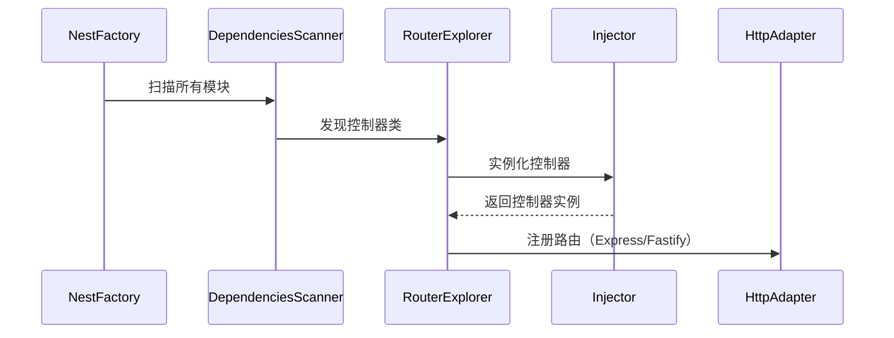
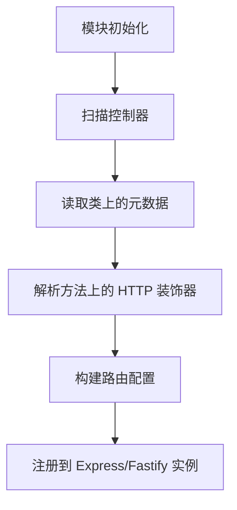

## Controller 的声明与作用

```js
@Controller('users')
export class UserController {
  @Get() findAll() {
    return [];
  }
}
```

* `@Controller('users')` 将类标记为路由控制器，定义基础路径 `/users`。
* `@Get()` 将方法映射到 `GET /users` 路由。

### 1. Nest 如何发现并注册这些装饰的控制器？

#### Controller 装饰器的实现

> 源码文件位置：@nestjs/common/decorators/core/controller.decorator.ts
> 装饰器的核心作用是通过 reflect-metadata 为控制器类添加元数据，这些元数据会被 NestJS 框架在启动时读取和使用：

```ts
export function Controller(prefixOrOptions?: string | string[] | ControllerOptions): ClassDecorator {
  const defaultPath = '/';

  // 这一段是整个装饰器的“心脏”，负责解析传入的参数，并统一成标准格式：
  const [path, host, scopeOptions, versionOptions] = isUndefined(
    prefixOrOptions,
  )
    ? [defaultPath, undefined, undefined, undefined]
    : isString(prefixOrOptions) || Array.isArray(prefixOrOptions)
      ? [prefixOrOptions, undefined, undefined, undefined]
      : [
        prefixOrOptions.path || defaultPath,
        prefixOrOptions.host,
        { scope: prefixOrOptions.scope, durable: prefixOrOptions.durable },
        Array.isArray(prefixOrOptions.version)
          ? Array.from(new Set(prefixOrOptions.version))
          : prefixOrOptions.version,
      ];

  // NestJS 使用 Reflect.defineMetadata 向类上添加各种元信息，这些信息在后续框架运行时会被读取并用来构建控制器、注册路由等。
  return (target: object) => {
    Reflect.defineMetadata(CONTROLLER_WATERMARK, true, target); // 标记为控制器
    Reflect.defineMetadata(PATH_METADATA, path, target); // 路由前缀
    Reflect.defineMetadata(HOST_METADATA, host, target); // 域名
    Reflect.defineMetadata(SCOPE_OPTIONS_METADATA, scopeOptions, target); // 作用域
    Reflect.defineMetadata(VERSION_METADATA, versionOptions, target); // 版本
  };
}
```

eg.

```ts
@Controller({
  path: 'admin', // 路由前缀
  host: 'admin.example.com',// 域名
  version: ['1', '2'], // 版本
  scope: Scope.REQUEST, // 作用域
})
export class AdminController {
  @Get('dashboard')
  getDashboard() {
  } // 路由: GET v1/admin/dashboard 或 v2/admin/dashboard
}
```

> host 的作用（基于域名的路由控制）,admin.example.com → 访问后台 、api.example.com → 访问 API、 example.com → 访问主站
> * 访问 https://admin.example.com → 返回后台页面
> * 访问 https://api.example.com → 返回 API 数据
> * 访问 https://example.com → 这两个控制器均不响应
>
> 需要配置服务器（如 Nginx）或 DNS 将子域名指向同一服务。

```ts
@Controller({ host: 'admin.example.com' })
export class AdminController {
  @Get()
  getAdminPage() {
    return '这是后台管理页面';
  }
}

@Controller({ host: 'api.example.com' })
export class ApiController {
  @Get()
  getData() {
    return { data: 'API 数据' };
  }
}
```

> Scope 的本质：控制依赖实例的生命周期
> 在 NestJS 中，几乎所有的类（如 Controller、Service、Provider）都是由 依赖注入（DI）容器 管理的。scope 决定了这些类的实例：
>* 何时创建（比如每次请求都新建，还是全局只建一个）
>* 何时销毁（比如请求结束后是否自动清理）
>* 如何共享（不同地方注入的是否是同一个实例）
>
> NestJS 提供了 3 种作用域（Scope）：
>
>1. `DEFAULT`（默认）：单例模式，整个应用共享一个实例。适用场景：
>* 无状态服务（如工具类、配置服务）
>* 数据库连接池（全局共享）
>* 缓存服务（如 Redis 客户端）
>2. `REQUEST`：每个 HTTP 请求都会创建一个新实例，请求结束后销毁。适用场景：
>* 需要访问请求上下文（如 Request 对象）
>* 需要隔离请求之间的数据（如用户鉴权、事务管理）
>* 避免并发问题（如请求间共享可变状态）
>3. `TRANSIENT`：每次注入时都创建一个新实例（极少使用）。适用场景：
>* 需要完全隔离实例（如临时计算服务）
>* 极少使用，除非有特殊需求。

#### HTTP 方法装饰器（@Get, @Post 等）

这些装饰器用于将类方法标记为处理特定 HTTP 请求的方法。
> 源码位置：/@nestjs/common/decorators/http/request-mapping.decorator.ts

```ts
export const RequestMapping = (
  metadata: RequestMappingMetadata = defaultMetadata,
): MethodDecorator => {
  const pathMetadata = metadata[PATH_METADATA];
  const path = pathMetadata && pathMetadata.length ? pathMetadata : '/';
  const requestMethod = metadata[METHOD_METADATA] || RequestMethod.GET;

  return (
    target: object,
    key: string | symbol,
    descriptor: TypedPropertyDescriptor<any>,
  ) => {
    Reflect.defineMetadata(PATH_METADATA, path, descriptor.value);
    Reflect.defineMetadata(METHOD_METADATA, requestMethod, descriptor.value);
    return descriptor;
  };
};

const createMappingDecorator =
  (method: RequestMethod) =>
    (path?: string | string[]): MethodDecorator => {
      return RequestMapping({
        [PATH_METADATA]: path,
        [METHOD_METADATA]: method,
      });
    };

export const Get = createMappingDecorator(RequestMethod.GET);
```

#### 参数装饰器（@Param, @Body 等）

参数装饰器的作用是告诉框架：这个参数应该从请求的哪一部分提取？
> 源码位置：/@nestjs/common/decorators/http/route-params.decorator.ts

### > 2. 装饰器如何将元数据转化为实际的路由逻辑？

Nest 启动时通过以下步骤处理控制器：





#### 阶段 1：模块初始化 & 控制器扫描 </br>

在 NestFactory.create() 初始化阶段，InstanceLoader 和 DependenciesScanner 会扫描模块的 controllers 数组（如 AppModule
中声明的控制器）。

``const app = await NestFactory.create(AppModule);`` </br>
``NestFactory.create() -> InstanceLoader.createInstances()``

```ts
@Module({
  imports: [UsersModule],
  controllers: [AppController],
  providers: [AppService],
})
export class AppModule {
}
```

#### 阶段 2：控制器类元数据读取 </br>

使用 Reflect.getMetadata() 获取控制器类上的信息：

```ts
const path = Reflect.getMetadata(PATH_METADATA, controllerClass);
const host = Reflect.getMetadata(HOST_METADATA, controllerClass);
const version = Reflect.getMetadata(VERSION_METADATA, controllerClass);
```

#### 阶段 3：方法装饰器元数据读取 </br>

```ts
for (const methodName of Object.getOwnPropertyNames(target.prototype)) {
  const methodHandler = target.prototype[methodName];
  const httpMethod = Reflect.getMetadata(HTTP_METHOD_METADATA, methodHandler);
  const routePath = Reflect.getMetadata(PATH_METADATA, methodHandler);
}
```

#### 阶段 4：构建完整路由路径 </br>
将控制器级路径和方法级路径拼接起来,同时考虑版本号、主机名等高级特性。

```ts
const fullRoute = `${controllerPath}/${methodPath}`;
// 例如：/cats/list
```

#### 阶段 5：注册到 Express / Fastify </br>
最后，使用底层平台（Express 或 Fastify）提供的 API 将路由注册进去。
> 源码位置：packages/core/router/routes-resolver.ts(RoutesResolver 类的实现，它负责解析控制器并注册路由)
>
> 源码位置：packages/core/router/router-explorer.ts(RouterExplorer 类，该类用于探索控制器方法并注册路由)


#### 例如

```ts
@Controller('cats')
class CatsController {
  @Get(':id')
  findOne(@Param('id') id: string) {
    return { id };
  }
}
```

1. 扫描到 CatsController 类上有 @Controller('cats')
2. 读取其路径为 /cats
3. 遍历方法 findOne，发现有 @Get(':id') 和 @Param('id')
4. 构建出完整路径为 /cats/:id
5. 使用 Express 的 app.get('/cats/:id', handler) 注册路由
6. 当请求 /cats/123 时，调用 findOne 方法，并自动注入 id=123

### 阶段总结：
在这里你可以找到应用程序初始化的过程
> 源码位置：packages/core/nest-application.ts
> 源码位置：packages/core/nest-factory.ts

#### 1. 装饰器与元数据机制
NestJS 使用了 TypeScript 的装饰器和 reflect-metadata 库来实现依赖注入、AOP（面向切面编程）等功能。
装饰器允许我们在类、方法或属性上添加额外的元数据信息。
* 类装饰器：如 @Controller()，用于标记一个类为控制器，并设置基础路径。
* 方法装饰器：如 @Get(), @Post() 等，用于定义 HTTP 方法及子路径。
* 参数装饰器：如 @Param(), @Query(), @Body() 等，用于从请求中提取特定的数据并注入到方法参数中。

这些装饰器通过 Reflect.defineMetadata() 将相关信息存储为元数据，供框架在运行时使用。

#### 2. 控制器扫描与元数据收集
当应用启动时，NestJS 会自动扫描模块中的所有控制器。对于每个控制器：
* 读取类上的元数据：如 PATH_METADATA（基础路径）、HOST_METADATA（主机限制）、VERSION_METADATA（版本控制）等。
* 遍历类的方法：检查每个方法是否有 HTTP 方法装饰器（如 @Get()），并读取相应的元数据（HTTP 方法类型、子路径等）。
* 解析方法参数：通过 ROUTE_ARGS_METADATA 获取参数装饰器的信息，了解每个参数的来源（路径参数、查询参数、请求体等）。


#### 3. 构建完整路由配置
基于上述元数据，NestJS 构建出完整的路由配置：
* 拼接路径：将控制器的基础路径和方法的子路径拼接起来形成最终的路由路径。
* 注册路由：根据 HTTP 方法类型（GET, POST, PUT 等），将路由注册到 Express 或 Fastify 实例中。例如，对于 @Get('/cats/:id')，会在 Express 中注册一个 GET 路由 /cats/:id。

#### 4. 中间件封装与参数注入
当有请求到达时，Express/Fastify 会调用对应的路由处理函数。NestJS 在这里做了一些额外的工作：
* 参数注入：根据 ROUTE_ARGS_METADATA 提取请求中的相应部分（如路径参数、查询参数、请求体等），并按顺序注入到控制器方法中。
* 执行控制器方法：调用控制器方法，并将结果返回给客户端。