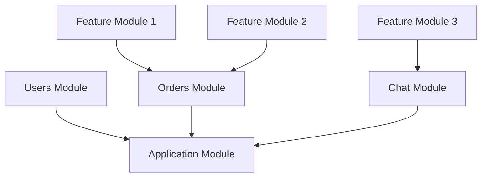

## Module 模块

模块是一个用 @Module() 装饰器注解的类。该装饰器提供了 Nest 用于高效组织和管理应用结构的元数据。



### Providers

* 定义：Providers 是提供依赖注入的服务。它们通常是带有 @Injectable() 装饰器的类（如服务），也可以是值、工厂函数等。
* 用途：在模块中声明 providers 使得这些服务可以在该模块内被注入到其他类（如控制器、其他服务）中使用。

### Controllers

* 定义：控制器负责处理传入的 HTTP 请求，并返回响应。它们通常包含路由和业务逻辑。
* 用途：在模块中声明控制器意味着这些控制器属于该模块，并且可以访问该模块中的 providers。

### Imports

* 定义：Imports 是用来引入其他模块的。当你需要使用另一个模块提供的功能（如 services 或者 controllers）时，你需要将那个模块导入当前模块。
* 用途：通过导入其他模块，你可以访问那些模块中导出的 providers 或其他对象。

### Exports

* 定义：Exports 用于指定哪些 providers 或者其他对象可以从当前模块导出，以便其他模块可以通过导入当前模块来使用这些导出的对象。
* 用途：只有被导出的对象才能被导入当前模块的其他模块所使用。

```ts
// shared.module.ts
import { Module } from '@nestjs/common';
import { SharedService } from './shared.service';

@Module({
  providers: [SharedService],
  exports: [SharedService], // 导出 SharedService
})
export class SharedModule {
}

// user.module.ts
import { Module } from '@nestjs/common';
import { UserController } from './user.controller';
import { UserService } from './user.service';
import { SharedModule } from '../shared/shared.module';

@Module({
  imports: [SharedModule], // 导入 SharedModule 以使用 SharedService
  providers: [UserService],
  controllers: [UserController],
})
export class UserModule {
}

// user.controller.ts
import { Controller, Get } from '@nestjs/common';
import { UserService } from './user.service';
import { SharedService } from '../shared/shared.service';

@Controller('users')
export class UserController {
  constructor(
    private readonly userService: UserService,
    private readonly sharedService: SharedService, // 注入 SharedService
  ) {
  }

  @Get()
  findAll() {
    return this.userService.findAll();
  }
}
```

在这个例子中，SharedModule 提供了一个 SharedService 并将其导出，而 UserModule 通过 imports 引入了 SharedModule，从而能够在
UserController 中注入并使用 SharedService。

### Module 的错误用法

#### 错误实例
```ts
@Module({
  providers: [UserService, SharedService], // 手动添加 SharedService 到 providers
  controllers: [UserController],
})
export class UserModule {}
```

#### 正确实例
```ts
@Module({
  imports: [SharedModule], // 从 SharedModule 导入 SharedService
  providers: [UserService],
  controllers: [UserController],
})
export class UserModule {}
```

如果你手动把 SharedService 放进 UserModule 的 providers 数组里，确实可以让 NestJS 实例化这个服务，并允许你在控制器或其它服务中注入使用它。

> 缺陷：违背了模块化设计原则
> 1. 破坏模块封装性 </br>
> 模块的核心作用之一就是封装和组织功能。SharedService 如果属于 SharedModule，那么它的职责、生命周期、依赖都应该由 SharedModule 来管理。
> 如果每个模块都手动重复声明 SharedService，就等于把这个服务的实例散布到多个模块中，失去了模块封装的意义。
> 2. 失去单例共享机制（Singleton）</br>
> 默认情况下，NestJS 中的 provider 是单例的 —— 每个模块导入同一个服务时，实际上引用的是同一个实例。
> * 数据不一致
> * 缓存失效
> * 性能下降
> 3. 难以维护与扩展 </br>
> 假设 SharedService 本身还依赖了其他服务（比如 LoggerService, ConfigService）
> 这时候如果你手动写 providers: [SharedService]，你就必须同时手动提供所有依赖项，否则就会报错，你还需要引入 LoggerService 和 ConfigService


#### 模块设计的核心理念和用法

##### 1. 每个模块是一个功能单元
* 模块应封装一组相关的功能（如用户管理、日志记录、数据库访问等）。
* 模块内部定义自己的服务、控制器、管道、守卫等。


##### 2. 模块之间通过 imports 和 exports 共享功能
* 如果某个模块需要使用另一个模块的功能，就通过 imports 明确引入它。
* 被引入模块必须将对应的服务通过 exports 导出，才能被外部访问。

##### 3. 避免在多个模块中重复声明同一个 provider
* 否则会创建多个实例，破坏单例行为。
* 容易导致状态不一致、难以调试和维护。
* 